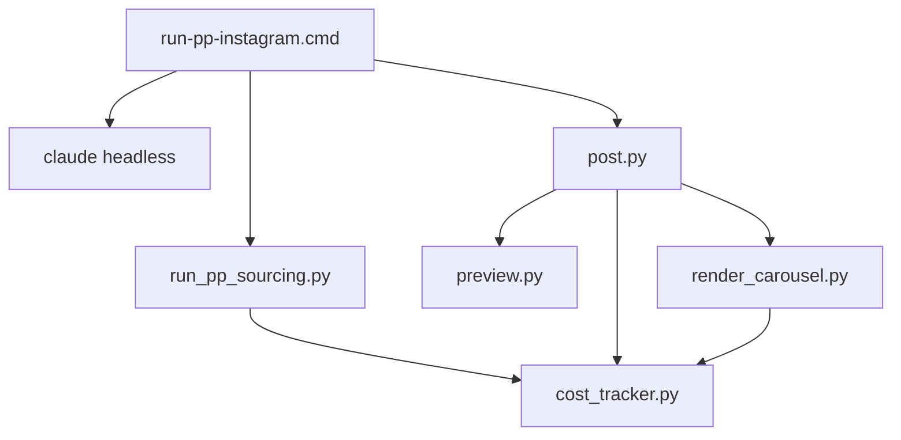

# Scripts — referência (os arquivos reais ficam em `02-maquina-agentes/scripts/`)

A skill **invoca** estes scripts, mas os arquivos não vivem dentro do skill folder.

**Por quê?** Os scripts usam `ROOT = Path(__file__).parent.parent` pra encontrar `pages/`,
`data/`, `.env` etc. Movê-los pra cá quebraria os paths sem ganho real — eles já estão na
convenção do projeto (`02-maquina-agentes/scripts/`).

Esta pasta serve como **documentação dos scripts da skill** (o que é cada um, qual ordem
de execução, dependências).

---

## Scripts da skill `instagram-motor`

### Orquestração principal

| Script | Path real | Função | Custos |
|---|---|---|---|
| **`post.py`** | `02-maquina-agentes/scripts/post.py` | Orquestrador end-to-end (modo generate/publish/dry-run). Lê `content.json` → gera mídia (Gemini/Veo) → render overlay → Zernio | Gemini R$ 0,01 ou Veo R$ 2,88 por execução |
| **`run_pp_sourcing.py`** | `02-maquina-agentes/scripts/run_pp_sourcing.py` | Sourcing diário: 1-2 queries Grok direcionadas pelo pilar do dia → `digest.md` | ~R$ 0,30 por execução |
| **`preview.py`** | `02-maquina-agentes/scripts/preview.py` | Gera `preview.html` por data + `_dashboard.html` global. Chamado pelo post.py automaticamente. | R$ 0 |
| **`render_carousel.py`** | `02-maquina-agentes/scripts/render_carousel.py` | Render multi-slide pra carrosséis (Pilar Educação + Prova Social). Lê template de `assets/template-carousel-slide.html`. | R$ 0,01 × N slides (Gemini) |

### Utilitários

| Script | Função |
|---|---|
| **`cost_tracker.py`** | Registra cada chamada OpenRouter em `data/_gastos/openrouter.csv` (timestamp, script, model, purpose, custo). Importado por `post.py` e `run_pp_sourcing.py`. CLI: `python scripts/cost_tracker.py 2026-06` mostra resumo. |
| **`run-pp-instagram.cmd`** | Wrapper Windows que Task Scheduler dispara 10h BRT. Roda sourcing → claude headless gera content.json → `post.py` (sem postar) → gera preview. |

### Scripts de teste / setup (NÃO rodam em produção)

| Script | Função | Status |
|---|---|---|
| `test_grok_live_search.py` | Validou Grok 4.3 + plugin web | 1× histórico |
| `compare_gemini_25_vs_31.py` | Comparou qualidade Gemini 2.5 vs 3.1 | 1× histórico |
| `test_veo_reflexivo.py` | Validou Veo 3.1 Fast (depois trocado por Lite) | 1× histórico |
| `gen_reel_reflexivo.py` | Versão standalone do Reel (substituído por `post.py`) | obsoleto |
| `overlay_reflexivo.py` | Substituído pela função `render_reel_reflexivo()` no `post.py` | obsoleto |
| `skill_test_inspiracao_v2.py` | Validou pipeline com Lençóis Maranhenses | 1× histórico |

---

## Ordem típica de execução (10h BRT)

```
1. run-pp-instagram.cmd
     ├── 2. run_pp_sourcing.py
     │     └── (Grok 1-2 queries) → digest.md
     ├── 3. claude.cmd headless
     │     ├── invoca copy-specialist subagent
     │     ├── invoca visual-specialist subagent
     │     └── → content.json
     └── 4. post.py (modo generate, sem --publish)
           ├── 5. gen mídia (Gemini OR Veo)
           ├── 6. render (template V2 ou Reel ffmpeg)
           └── 7. preview.py → preview.html + _dashboard.html
```

Pedro revisa o dashboard quando senta no PC.
Fala "posta" no chat → Claude interativo roda:

```
8. post.py --date YYYY-MM-DD --publish
     ├── upload Zernio
     ├── update historico.md
     ├── ideias/disponiveis.md → usadas.md
     └── banco-frases/disponiveis.md → usadas.md (se foi Reel)
```

---

## Dependências entre scripts



`cost_tracker.py` é importado por TODOS os scripts que chamam OpenRouter.
